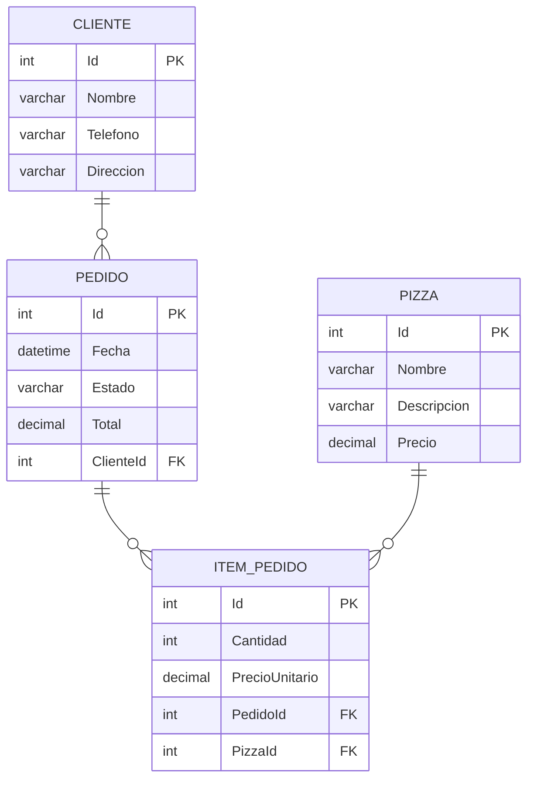

# Diagrama Entidad-Relación

```mermaid
erDiagram

    CLIENTE {
        int Id PK
        varchar Nombre
        varchar Telefono
        varchar Direccion
    }

    PEDIDO {
        int Id PK
        datetime Fecha
        varchar Estado
        decimal Total
        int ClienteId FK
    }

    ITEM_PEDIDO {
        int Id PK
        int Cantidad
        decimal PrecioUnitario
        int PedidoId FK
        int PizzaId FK
    }

    PIZZA {
        int Id PK
        varchar Nombre
        varchar Descripcion
        decimal Precio
    }

    
    CLIENTE ||--o{ PEDIDO : ""

    PEDIDO ||--o{ ITEM_PEDIDO :""

    PIZZA ||--o{ ITEM_PEDIDO :""
```