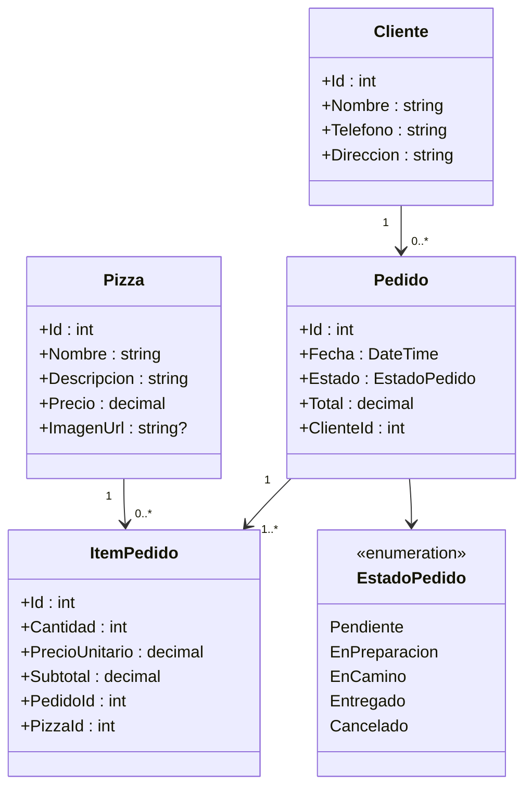

# Diagrama de clases    

```mermaid
classDiagram

class Cliente{
    +Id : int
    +Nombre : string
    +Telefono : string
    +Direccion : string
}

class Pedido{
    +Id : int
    +Fecha : DateTime
    +Estado : EstadoPedido
    +Total : decimal
    +ClienteId : int
}

class ItemPedido{
    +Id : int
    +Cantidad : int
    +PrecioUnitario : decimal
    +Subtotal : decimal
    +PedidoId : int
    +PizzaId : int
}

class Pizza{
    +Id : int
    +Nombre : string
    +Descripcion : string
    +Precio : decimal
    +ImagenUrl : string?
}

class EstadoPedido{
    <<enumeration>>
    Pendiente
    EnPreparacion
    EnCamino
    Entregado
    Cancelado
}

Cliente "1" --> "0..*" Pedido
Pedido "1" --> "1..*" ItemPedido
Pizza "1" --> "0..*" ItemPedido
Pedido --> EstadoPedido

```