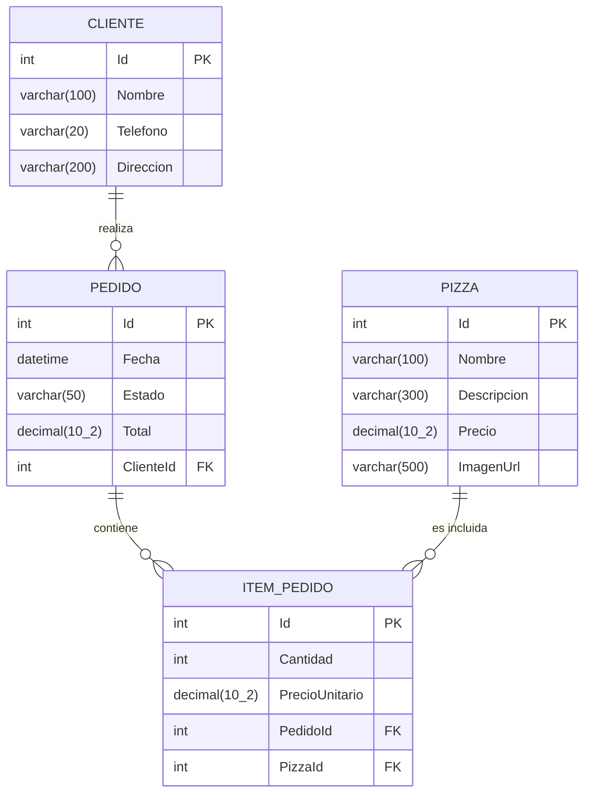
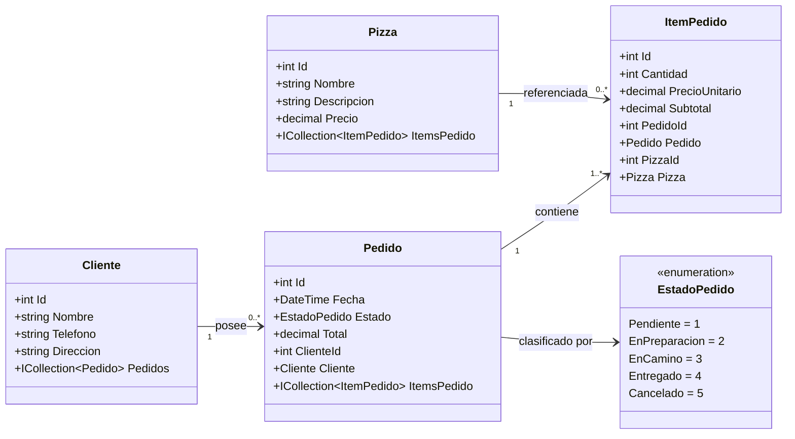

# Estado Actual del Proyecto PizzaPlaneta 🍕

> **E.T. Nº12 D.E. 1º "Libertador Gral. José de San Martín"**  
> **Materia:** Programación Sobre Redes  
> **Autores:** Luka Pasandi Dabek y Angel Nahuel López  
> **Fecha de relevamiento:** Septiembre 2026  

---

## 1. Visión General y Arquitectura de la Solución

El proyecto **PizzaPlaneta** es un sistema para la gestión de pedidos y catálogo de una pizzería, desarrollado sobre **.NET 10** (`net10.0`) y **C# 13/14**. La solución está estructurada en tres proyectos con responsabilidades delimitadas:

```
┌────────────────────────────────────────────────────────────────────────┐
│                        PizzaPlaneta.slnx                               │
├────────────────────────────────────────────────────────────────────────┤
│                                                                        │
│   ┌───────────────────────────┐       ┌────────────────────────────┐   │
│   │      PizzaPlanetMVC       │       │       PizzaPlanetaApi      │   │
│   │   (Frontend Web / Razor)  │       │  (ASP.NET Core Minimal API)│   │
│   └─────────────┬─────────────┘       └─────────────┬──────────────┘   │
│                 │                                   │                  │
│                 │          Referencia a             │                  │
│                 └─────────────────┬─────────────────┘                  │
│                                   ▼                                    │
│                     ┌───────────────────────────┐                      │
│                     │   PizzaPlanetBiblioteca   │                      │
│                     │  (Entidades, Enums, DTOs) │                      │
│                     └───────────────────────────┘                      │
│                                                                        │
└────────────────────────────────────────────────────────────────────────┘
```

### Proyectos de la Solución

1. **`PizzaPlanetBiblioteca`** (`PizzaPlanetBiblioteca/`):
   - Biblioteca de clases compartida.
   - Contiene el núcleo de dominio: entidades, enumeraciones y objetos de transferencia de datos (DTOs).
   - No tiene dependencias externas, asegurando desacoplamiento.

2. **`PizzaPlanetaApi`** (`PizzaPlanetaApi/`):
   - Backend RESTful desarrollado con **ASP.NET Core Minimal APIs**.
   - Acceso a datos con **Entity Framework Core 9.0** y **Pomelo.EntityFrameworkCore.MySql**.
   - Mapeo declarativo y modular de endpoints por entidad.
   - Documentación y explorador interactivo mediante **Swagger / OpenAPI**.

3. **`PizzaPlanetMVC`** (`PizzaPlanetMVC/`):
   - Aplicación web con arquitectura Modelo-Vista-Controlador y motor de vistas Razor.
   - Destinada a ser el portal interactivo para clientes y administración (actualmente en etapa inicial).

---

## 2. Capa de Dominio y Modelo de Datos

### 2.1 Diagrama Entidad-Relación



### 2.2 Diagrama de Clases



### 2.3 Descripción de Entidades

- **`Cliente`** (`PizzaPlanetBiblioteca.Entidades.Cliente`):
  - Modela al comprador. Almacena datos de contacto y entrega (`Nombre`, `Telefono`, `Direccion`) y su historial de pedidos.
- **`Pizza`** (`PizzaPlanetBiblioteca.Entidades.Pizza`):
  - Modela los productos disponibles en el menú (`Nombre`, `Descripcion`, `Precio`).
- **`Pedido`** (`PizzaPlanetBiblioteca.Entidades.Pedido`):
  - Encapsula la orden de compra. Registra fecha, total monetario, cliente asociado y estado de avance.
- **`ItemPedido`** (`PizzaPlanetBiblioteca.Entidades.ItemPedido`):
  - Entidad asociativa entre `Pedido` y `Pizza`. Guarda la cantidad requerida y realiza un **snapshot** del precio unitario de la pizza al momento de la transacción. Posee la propiedad computada `Subtotal => Cantidad * PrecioUnitario`.
- **`EstadoPedido`** (`PizzaPlanetBiblioteca.Enums.EstadoPedido`):
  - Enumeración numérica (`Pendiente=1`, `EnPreparacion=2`, `EnCamino=3`, `Entregado=4`, `Cancelado=5`).

---

## 3. Catálogo de DTOs (Data Transfer Objects)

Los DTOs desacoplan el modelo relacional de la base de datos de los contratos de entrada/salida HTTP expuestos a los clientes:

### Clientes (`PizzaPlanetaBiblioteca.DTOs.Clientes`)
- **`ClienteDto`**: Datos de salida (`Id`, `Nombre`, `Telefono`, `Direccion`).
- **`CrearClienteDto`**: Datos de entrada para alta (`Nombre`, `Telefono`, `Direccion`).
- **`ActualizarClienteDto`**: Datos de entrada para modificación total (`Nombre`, `Telefono`, `Direccion`).

### Pizzas (`PizzaPlanetaBiblioteca.DTOs.Pizzas`)
- **`PizzaDto`**: Datos de salida (`Id`, `Nombre`, `Descripcion`, `Precio`).
- **`CrearPizzaDto`**: Datos requeridos para incorporar una pizza al catálogo (`Nombre`, `Descripcion`, `Precio`).
- **`ActualizarPizzaDto`**: Datos para actualizar características o precio de una pizza existente (`Nombre`, `Descripcion`, `Precio`).

### Pedidos (`PizzaPlanetaBiblioteca.DTOs.Pedidos`)
- **`CrearPedidoDto`**: Contrato para solicitar un pedido (`ClienteId`, `List<CrearItemPedidoDto> Items`).
- **`CrearItemPedidoDto`**: Especificación de una línea de pedido (`PizzaId`, `Cantidad`).
- **`PedidoDto`**: Representación completa de un pedido (`Id`, `Fecha`, `Estado`, `Total`, nombre del `Cliente` y lista de `ItemPedidoDto`).
- **`ItemPedidoDto`**: Línea detallada devuelta al consultar un pedido (`PizzaId`, `Pizza` [nombre], `Cantidad`, `PrecioUnitario`, `Subtotal`).
- **`ActualizarEstadoPedidoDto`**: Contrato para modificar únicamente el estado (`Estado`).

---

## 4. Persistencia y Configuración de Base de Datos

### 4.1 DbContext y Mapeo Fluent API
El contexto `PizzeriaDbContext` (`PizzaPlanetaApi/Datos/PizzeriaDbContext.cs`) administra los conjuntos de datos:
- `DbSet<Cliente> Clientes`
- `DbSet<Pizza> Pizzas`
- `DbSet<Pedido> Pedidos`
- `DbSet<ItemPedido> ItemsPedido`

Las restricciones y relaciones se configuran de forma modular mediante `IEntityTypeConfiguration<T>` bajo `PizzaPlanetaApi/Datos/Config/`:
- **`ClienteConfig`**: Tabla `Clientes`, clave primaria `Id`, campos obligatorios con límites de longitud y relación 1:N con `Pedido` (FK `ClienteId`).
- **`PizzaConfig`**: Tabla `Pizzas`, nombre obligatorio (100 car.), descripción (300 car.), precio con precisión decimal `(10, 2)`. Relación 1:N con `ItemPedido` (FK `PizzaId`).
- **`PedidoConfig`**: Tabla `Pedidos`, fecha obligatoria, total decimal `(10, 2)`, relación 1:N con `ItemPedido` (FK `PedidoId`). Almacena el enum `EstadoPedido` como cadena de texto (`HasConversion<string>()`).
- **`ItemPedidoConfig`**: Tabla `ItemsPedido`, cantidad obligatoria, precio unitario decimal `(10, 2)`.

### 4.2 Cadena de Conexión y Migraciones
- Configuración en `PizzaPlanetaApi/appsettings.json`:
  ```json
  "ConnectionStrings": {
    "PizzeriaDb": "server=localhost;port=3306;database=PizzaPlanetaDb;user=USUARIO;password=CONTRASEÑA;"
  }
  ```
- Migración aplicada: `20260714105516_InitialCreate.cs`.

---

## 5. Especificación Detallada de Endpoints REST

La API organiza sus rutas en grupos mediante métodos de extensión registrados en `Program.cs`.

### 5.1 Endpoints de Clientes (`/clientes`)

| Método | Ruta | Entrada | Respuesta Exitosa | Respuestas de Error | Descripción |
|---|---|---|---|---|---|
| `GET` | `/clientes` | - | `200 OK` → `List<ClienteDto>` | - | Obtiene la lista completa de clientes registrados. |
| `GET` | `/clientes/{id}` | `id` (int, ruta) | `200 OK` → `ClienteDto` | `404 Not Found` | Obtiene un cliente por su identificador único. |
| `POST` | `/clientes` | `CrearClienteDto` (JSON body) | `201 Created` → `ClienteDto` (`Location: /clientes/{id}`) | `400 Bad Request` | Registra un nuevo cliente en el sistema. |
| `PUT` | `/clientes/{id}` | `id` (int, ruta), `ActualizarClienteDto` (JSON body) | `204 No Content` | `404 Not Found` | Modifica los datos del cliente especificado. |
| `DELETE` | `/clientes/{id}` | `id` (int, ruta) | `204 No Content` | `404 Not Found` | Elimina al cliente de la base de datos. |

### 5.2 Endpoints de Pizzas (`/pizzas`)

| Método | Ruta | Entrada | Respuesta Exitosa | Respuestas de Error | Descripción |
|---|---|---|---|---|---|
| `GET` | `/pizzas` | - | `200 OK` → `List<PizzaDto>` | - | Consulta el catálogo completo de pizzas disponibles. |
| `GET` | `/pizzas/{id}` | `id` (int, ruta) | `200 OK` → `PizzaDto` | `404 Not Found` | Obtiene los detalles de una pizza por su ID. |
| `POST` | `/pizzas` | `CrearPizzaDto` (JSON body) | `201 Created` → `Pizza` (`Location: /pizzas/{id}`) | `400 Bad Request` | Añade una nueva variedad de pizza al menú. |
| `PUT` | `/pizzas/{id}` | `id` (int, ruta), `ActualizarPizzaDto` (JSON body) | `204 No Content` | `404 Not Found` | Actualiza la información y precio de una pizza. |
| `DELETE` | `/pizzas/{id}` | `id` (int, ruta) | `204 No Content` | `404 Not Found` | Elimina una pizza del catálogo. |

### 5.3 Endpoints de Pedidos (`/pedidos`)

| Método | Ruta | Entrada | Respuesta Exitosa | Respuestas de Error | Descripción |
|---|---|---|---|---|---|
| `GET` | `/pedidos` | - | `200 OK` → `List<PedidoDto>` | - | Lista todos los pedidos con cliente e ítems desglosados. |
| `GET` | `/pedidos/{id}` | `id` (int, ruta) | `200 OK` → `PedidoDto` | `404 Not Found` | Obtiene el detalle exhaustivo de un pedido por ID. |
| `POST` | `/pedidos` | `CrearPedidoDto` (JSON body) | `201 Created` → `{ id, total, estado }` | `400 Bad Request` | Valida reglas de negocio, calcula el total y crea el pedido. |
| `PUT` | `/pedidos/{id}/estado` | `id` (int, ruta), `ActualizarEstadoPedidoDto` (JSON body) | `204 No Content` | `404 Not Found` | Actualiza el estado dentro del ciclo de vida del pedido. |
| `DELETE` | `/pedidos/{id}` | `id` (int, ruta) | `204 No Content` | `404 Not Found` | Cancela/elimina un pedido registrado. |

---

## 6. Flujos de Información y Lógica de Negocio

### 6.1 Flujo de Creación de un Pedido (`POST /pedidos`)

```
 [ Cliente HTTP / Web MVC ]
             │
             │  POST /pedidos con CrearPedidoDto:
             │  { clienteId: 1, items: [ { pizzaId: 2, cantidad: 3 } ] }
             ▼
┌────────────────────────────────────────────────────────────────────────┐
│                      Pipeline de PedidoEndpoints                       │
├────────────────────────────────────────────────────────────────────────┤
│                                                                        │
│  1. Validación de Cliente:                                             │
│     db.Clientes.FindAsync(dto.ClienteId)                               │
│     ├─ No existe ──▶ Retorna 400 Bad Request ("El cliente no existe")  │
│     └─ Existe    ──▶ Continúa                                          │
│                                                                        │
│  2. Validación de Contenido mínimo:                                    │
│     dto.Items.Count == 0                                               │
│     ├─ Vacío     ──▶ Retorna 400 Bad Request ("Debe agregar...")       │
│     └─ Con ítems ──▶ Continúa                                          │
│                                                                        │
│  3. Instanciación de Cabecera:                                         │
│     Pedido { ClienteId = dto.ClienteId, Fecha = Now, Estado = Pendiente}│
│                                                                        │
│  4. Procesamiento de Líneas (Iteración de Items):                      │
│     Por cada itemDto en dto.Items:                                     │
│     ├─ db.Pizzas.FindAsync(itemDto.PizzaId)                            │
│     │  └─ No existe ──▶ Retorna 400 ("La pizza con ID X no existe")    │
│     ├─ Snapshot de precio: item.PrecioUnitario = pizza.Precio          │
│     ├─ Asignación de cantidad: item.Cantidad = itemDto.Cantidad        │
│     └─ Acumulación en memoria: total += pizza.Precio * item.Cantidad   │
│                                                                        │
│  5. Totalización y Persistencia:                                       │
│     pedido.Total = total                                               │
│     db.Pedidos.Add(pedido)                                             │
│     await db.SaveChangesAsync()                                        │
│                                                                        │
└────────────────────────────────────┬───────────────────────────────────┘
                                     │
                                     ▼
         Respuesta HTTP 201 Created: Location: /pedidos/{id}
         Body: { id: 1, total: 15400.00, estado: "Pendiente" }
```

### 6.2 Ciclo de Vida del Pedido

Los pedidos atraviesan diferentes etapas gestionadas a través del endpoint `PUT /pedidos/{id}/estado`:

```
   ┌─────────────┐
   │  Pendiente  │ ────▶ (Estado asignado automáticamente al crearse)
   └──────┬──────┘
          │
          ▼
   ┌───────────────┐
   │ EnPreparacion │ ────▶ (Cocina elabora los productos solicitados)
   └──────┬────────┘
          │
          ▼
   ┌─────────────┐
   │  EnCamino   │ ────▶ (Pedido despachado con personal de delivery)
   └──────┬──────┘
          │
          ▼
   ┌─────────────┐
   │  Entregado  │ ────▶ (Pedido recibido y completado)
   └─────────────┘

          ▲
          │
   ┌─────────────┐
   │  Cancelado  │ ◀─── (Transición permitida ante cancelación del pedido)
   └─────────────┘
```

---

## 7. Estado Actual del Proyecto Frontend (`PizzaPlanetMVC`)

El proyecto MVC (`PizzaPlanetMVC/`) fue inicializado recientemente y representa el esqueleto sobre el cual se montará la interfaz gráfica de usuario:

- **Estructura y Tecnologías**: ASP.NET Core MVC con Razor Views, Bootstrap 5.x y jQuery.
- **Controladores Actuales**:
  - `HomeController.cs`: Implementa únicamente las acciones base de plantilla (`Index()`, `Privacy()`, `Error()`).
- **Vistas Creadas**:
  - `Views/Home/Index.cshtml`: Pantalla de bienvenida con texto inicial.
  - `Views/Home/Pizzas.cshtml`: Vista preliminar para catálogo de pizzas.
- **Estado de Conexión con la API**:
  - **Pendiente**: Aún no tiene inyectado `HttpClient` ni `IHttpClientFactory` para realizar llamadas HTTP hacia `PizzaPlanetaApi`.
  - **Pendiente**: No existen controladores dedicados (`PizzasController`, `PedidosController`, `ClientesController`) para gestionar el flujo de navegación de la pizzería.

---

## 8. Diagnóstico Técnico y Observaciones del Código

1. **Inconsistencia en Namespace de DTO**:
   - El archivo `PizzaPlanetBiblioteca/DTOs/Pedidos/ActualizarEstadoPedidoDto.cs` declara el namespace `PizzaPlanetaBiblioteca.Modelos.DTOs.Pedidos` (con `Modelos`).
   - Todos los demás DTOs utilizan `PizzaPlanetaBiblioteca.DTOs.Pedidos`.
   - Esto obligó a declarar en `PizzaPlanetaApi/global.cs` un `global using` extra. Se recomienda normalizarlo.

2. **Tipo de Retorno en `POST /pizzas`**:
   - En `PizzaEndpoints.cs`, el endpoint `POST /pizzas` devuelve directamente la entidad `Pizza` en lugar de proyectarla a `PizzaDto`. En contraste, `POST /clientes` sí devuelve `ClienteDto`.

3. **Consultas en bucle en `CrearPedido` (N+1 Selects)**:
   - Al iterar los ítems del pedido se invoca `await db.Pizzas.FindAsync(itemDto.PizzaId)` individualmente por cada producto. Para pedidos grandes, puede optimizarse recuperando todas las pizzas involucradas en una única consulta batch mediante `Where(p => ids.Contains(p.Id))`.

4. **Inconsistencia de Enlace en `_Layout.cshtml`**:
   - En el menú de navegación de `_Layout.cshtml` se hace referencia a `asp-controller="Home" asp-action="Pizza"`, pero dicha acción no existe en `HomeController` (la vista correspondiente se llama `Pizzas.cshtml`).
